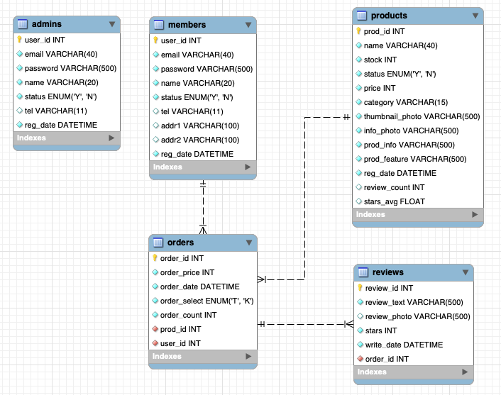
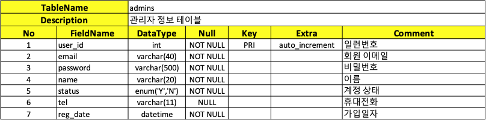
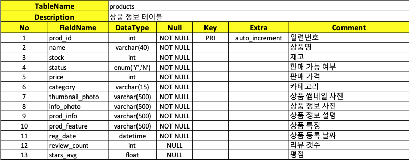
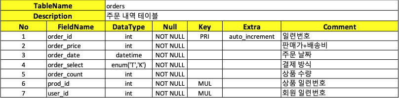
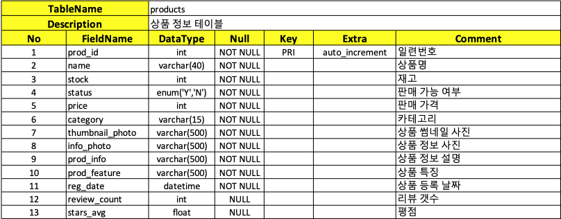
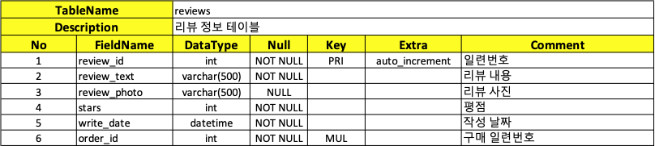

# TheGreatCatsby-Database

## 👋 소개

위대한캣츠비 프로젝트 데이터베이스입니다.

 

## 👥 멤버

|                                   |                                |                                |                               |                                 |
| ------------------------------------------------------------------- | --------------------------------------------------------------- | ---------------------------------------------------------------- | -------------------------------------------------------------- | ----------------------------------------------------------------- |
| 
[이병민](https://github.com/ByeongminLee)
 | 
[김우영](https://github.com/0x000613)
 | 
[노희재](https://github.com/heejj1206)
 | 
[이슬기](https://github.com/abcabcp)
 | 
[전찬민](https://github.com/cksals3753)
 |

 

## 📋 ERD

 

## 🗂️ 테이블 명세서

#### 관리자 정보 테이블

#### 사용자 정보 테이블

#### 주문 내역 테이블

#### 상품 정보 테이블

#### 리뷰 정보 테이블

 

## ⚙️ 파일

-   테이블 생성 SQL
    <code>./Table/Table.sql</code>

-   테스트용 데이터
    <code>./Table/TestData.sql</code>
